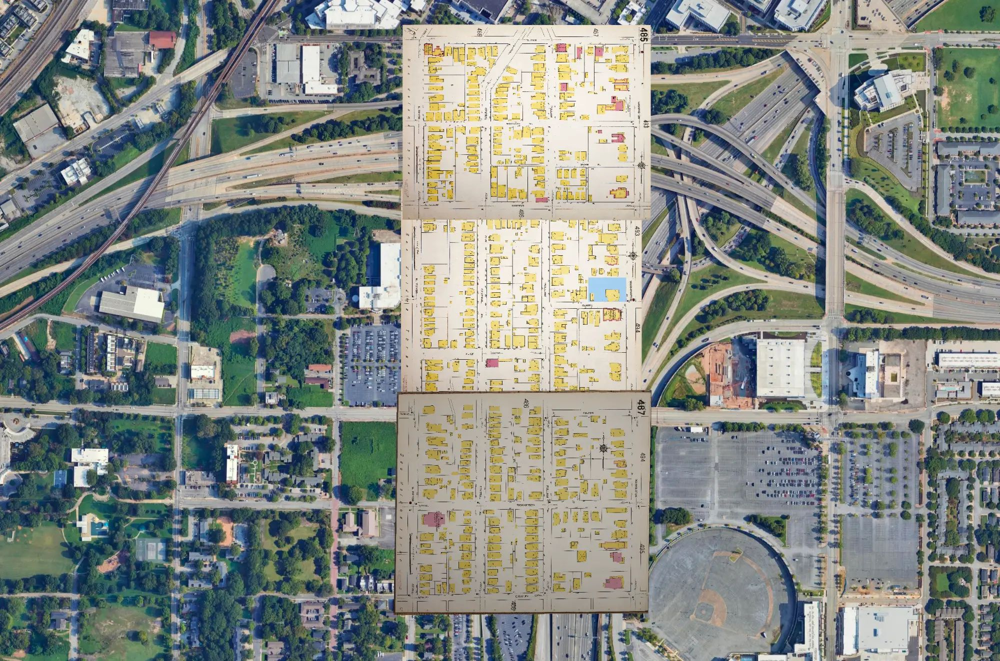
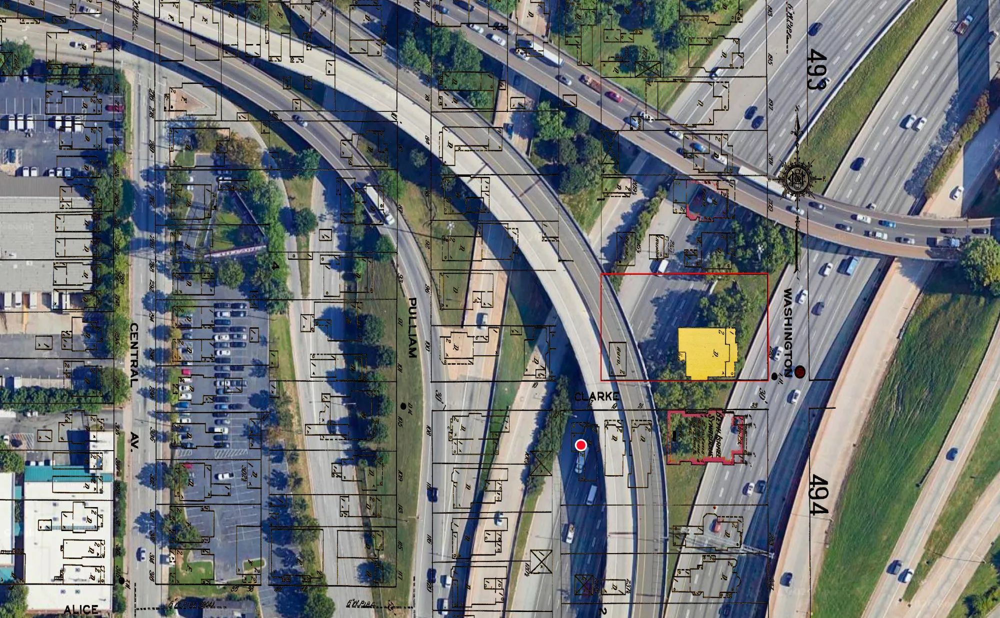

# AI Automated Sanborn Bot

Downloads the 1911 Atlanta Sanborn fire insurance maps from the Library of Congress, works
out where each sheet belongs on the ground, and prepares it as a georeferenced layer for
QGIS. Current system version: **1.19**.

Historic Sanborn maps have been scanned and publicly readable for years without being
georeferenced, so until GIS tools came along, historical study meant holding a picture of a map beside a real map. Even with GIS georeferencing, pinning an old map to a current map accurately takes hours per map.This repository holds a local system that automates the placement of Sanborns for Atlanta.

Three adjoining 1911 sheets covering Summerhill, placed by the engine over present-day aerial
imagery. Current work requires reviewed street controls and independent checks for each sheet.

## The problem the highway creates

Georeferencing a historic sheet needs intersections that exist both in 1911 and today. Across
much of south and east Atlanta the interstate removed them. Streets were cut, renamed, or
erased, and what survives of the grid is thin and moved.

The same ground in detail. The 1911 footprints sit over lanes that did not exist when the sheet
was drawn.

Four things let a sheet land anyway:

- **Reviewed name aliases.** `config/street_aliases.json` maps a historic street name to its
  modern one. Every entry carries evidence text and an approved status, and an unapproved alias
  is never used. Three are approved today, covering Houston Street (now John Wesley Dobbs
  Avenue) and Butler Street (now Jesse Hill Junior Drive).
- **Exact OpenStreetMap nodes.** A control point is accepted only where two named ways share a
  node in a local 40 MB Atlanta street database. A bridge passing over a road without a shared
  node is not counted as an intersection.
- **The 1921 Kauffman map.** OpenStreetMap is the modern ground truth. O. F. Kauffman's *Map of
  the City of Atlanta and Suburbs, 1921* is the required historical cross-check, reprojected and
  cropped to the same extent so the sheet can be compared against a map drawn ten years after
  it, before the highway.
- **House numbers are kept out of the control logic.** Atlanta renumbered its streets in 1927,
  so a street number printed in 1911 does not point at the same building on a later map.

## Approved sources only, with a citation on every sheet

Work that scholars and journalists can rely on has to be traceable to the page it came from, so
the engine is restricted to sources decided in advance and records where each one came from.

- Downloads come from four Library of Congress volume catalogs and nowhere else:
  [sanborn01378_006](https://www.loc.gov/item/sanborn01378_006/),
  [_007](https://www.loc.gov/item/sanborn01378_007/),
  [_008](https://www.loc.gov/item/sanborn01378_008/), and
  [_009](https://www.loc.gov/item/sanborn01378_009/). 396 printed sheets are cataloged.
- Each sheet's catalog row stores its Library of Congress item URL, its volume, and the direct
  JP2 service URL, so the citation stays attached to the file.
- Source scans are read-only, every derivative gets a new filename, and no source map is
  uploaded to an outside service. The engine never solves or evades the Library of Congress
  human-verification challenge.
- A sheet's printed number is proven only by an exact Apple Vision reading of a printed title
  corner. Whole-sheet Tesseract readings stay suggestions and need confirmation.
- Every finished sheet gets a sidecar ledger recording the source SHA-256 and pixel dimensions,
  the three control points and how they were resolved, the transformation (Polynomial 1 global
  affine, EPSG:3857, cubic resampling), the distortion diagnostics, the safety limits it was
  tested against, and an affine provenance signature. The finished GeoTIFF embeds the same
  evidence, so a rewritten ledger alone cannot certify a stale raster.

The sheets were published in 1911 and are out of US copyright. The Kauffman map is in the
public domain through the
[Digital Library of Georgia](https://dlg.usg.edu/record/gsu_afpl_21).

## Where the engine stops

A command that exits zero is not proof that a map is in the right place, so placement is gated
on measured geometry. A sheet is held back when any of these is true:

- the scale ratio between the two axes exceeds 1.15;
- the axis angle falls outside 85 to 95 degrees;
- the transform mirrors the sheet;
- the control triangle covers less than 2% of the sheet, or spans less than 20% of either axis;
- the result lands more than 250 meters from the sheet's independently read index seed;
- the CRS is not EPSG:3857.

A distorted historical sheet can still proceed, with `--allow-distortion` and a written
reason that becomes part of the approval hash. That exception covers the scale-ratio and
axis-angle warnings only. It cannot waive mirroring, inadequate geometry, the wrong CRS, the
wrong neighborhood, or a failed seed check.

Each review attempt writes a new timestamped packet under `batch/reviews/tile-NNNN/` holding the
source sheet with labeled crosshairs, a georeferenced preview, the local OSM roads, the
reprojected Kauffman crop, and a four-panel contact sheet. An earlier packet is never edited or
reused, and approval is hash-locked to the exact images and inputs that were inspected.

## Running it

First setup:

    python3 tools/sanborn_batch.py doctor
    python3 tools/sanborn_batch.py catalog
    python3 tools/sanborn_batch.py osm-refresh
    python3 tools/sanborn_batch.py index-build

A sequential batch:

    python3 tools/sanborn_batch.py add 154-160
    python3 tools/sanborn_batch.py work 154-160

Three independent local jobs, the setting used on the M4 Max:

    python3 tools/sanborn_parallel.py 154-160 --jobs 3

Both routes stop at the judgment boundary. Neither approves controls or writes the protected
QGIS project.

When OCR misses a sheet's index location, returns competing locations, or is visibly wrong, a
reviewed seed is recorded without altering the shared OCR index:

    python3 tools/sanborn_batch.py confirm-seed 154 \
      --preview-pixel PREVIEW_X PREVIEW_Y \
      --reviewer "Joel" \
      --note "Visually confirmed the center of printed Tile 154 on the saved index preview"

`--preview-pixel` is an X/Y pixel in the hash-verified preview written by `index-build`. It is
not a Sanborn source pixel, a screenshot coordinate, or a full-resolution index pixel. Use
`--map-coordinate` instead when an EPSG:3857 position is already known. The reviewer and note
are required because this is a human evidence decision.

A completed proposal with zero ranked triplets is a real outcome. It means the sheet needs a
human look at its street names, and it is never reported as work still in progress.

`LOCAL BATCH ENGINE.md` holds the full command sequence in plain English.
`AI AUTOMATED SANBORN BOT - MASTER INSTRUCTIONS.md` holds the accuracy and recovery policy.
`AGENTS.md` records the non-obvious lessons later sessions have to keep.

## Placing a finished sheet in QGIS

After a sheet is verified, `tools/sanborn_qgis.py` validates its schema-3 import manifest and
prepares code for the live QGIS session. It checks the raster, ledger, source, immutable
controls, review and approval records, every packet artifact, the OSM and Kauffman inputs, the
renderer and font inputs, and the index-seed provenance before anything is added, and it rolls
back added layers if a later step fails.

Approved sheets go in printed-number order inside `1911 ATLANTA SANBORNS`, which sits
immediately below the orthorectified index layer and outside it. Every completed raster renders
at 100% opacity with Brightness 0, Gamma 1.0, Contrast 0 (no channel stretch), and band 4 as a real alpha band,
with the RGB band rows collapsed. The generated code contains no project-save call, and it
verifies that the protected `.qgz` modification time did not change.

The protected project at `JLS Master Map File.qgz` is never saved or closed by automation.

## What it needs

Python, GDAL including `gdal_edit.py`, Tesseract, Pillow, OpenCV, and clang for the Apple Vision
helper. `python3 tools/sanborn_batch.py doctor` reports what it finds.

Two notes on the current Mac toolchain, both outside this repository:

- Homebrew's Python 3.14 has a broken `pyexpat` link and cannot parse XML, which stops the OSM
  paths. Python 3.13 works.
- Homebrew's `libheif` is linked against `libx265.216.dylib` while the `x265` symlink points at
  4.3, which ships `.217`. Every GDAL command aborts at launch until `brew reinstall libheif`
  relinks it. `doctor` does not catch this, because it checks that the GDAL binaries exist on
  PATH rather than that they run.

## Current state

396 sheets are cataloged. Five have finished GeoTIFFs: 196, 236, 474, 486, and 487. The batch
queue holds two verified sheets and three waiting on human street review.

Version 1.19 passes all 174 engine tests, including real GDAL warping, embedded provenance,
independent historical street checks, approval changes and QGIS rollback. The app selects one
working GDAL installation and uses QGIS's matching coordinate definitions when Homebrew is
unavailable. Tests create their small source fixture with Pillow, so they do not depend on the
optional Homebrew-only gdal_create command.

Large source scans and finished GeoTIFFs stay out of the repository. They can be downloaded
again from the Library of Congress or rebuilt from the saved controls and audit records.

The earlier hands-on georeferencing workflow remains on the preserved branch
`legacy-manual-georeferencing-v1.9`, anchored at commit `253c137`. `main` carries the
local-first batch system.

## What this makes possible

Superimposing a historic sheet on current geospatial data is the slow step in telling a story
about a block that no longer exists. Summerhill is one reason to remove that step. It was among
the most racially and ethnically mixed neighborhoods in Atlanta for decades after
Reconstruction, and it was slower than the Old Fourth Ward to be divided by early Jim Crow
zoning, before the highway took much of it.

The same restriction that makes the maps citable applies to anything added next. If the Fulton
County commissioners of roads and revenues minutes are digitized, they can be searched the same
way, against a fixed list of approved sources, with page-level citations attached to whatever
comes back.

## Historical street measurements

`tools/sanborn_historical.py prepare TILE --reference washington-rawson-topo-1958`
builds source/reference previews for a prepared sheet. The typed app bridge supplies measurements
to `export TILE` on standard input: three fit corners plus at least three withheld check corners.
It writes a reviewed control proposal, never approval. `sanborn_batch.py packet` accepts its
`--historical-evidence` record, copies it into the immutable attempt and adds original-topo views
to the existing comparison. Reference files, preview, measurements and check errors remain bound
to the approval and final QGIS evidence chain. Planned adjustment-map lines are not control targets.

Preserve the legacy manual workflow. Previously preferred cardinal-v2 targets for486/493/494 and
the prior487 placement were superseded by September25,2026 original-topo evidence; register any
replacement point record to its actual scan before reuse. Do not apply one tile's scale globally.

2026-09-25 appearance correction: preserve the original TIFF appearance. Brightness and contrast stay at 0, gamma at 1, opacity at 100%, alpha band 4, and RGB channel stretching is disabled. This supersedes every earlier enhanced-display preset; it does not alter the source pixels.

## Completed evidence and new reviews (1.18)

Completed maps retain verifiable source, controls, approval, raster and ledger evidence after software or display defaults change. New approvals and new warps still require current evidence. Reopening clears the active comparison while preserving historical records and verified copies of prior results. The superseded 486, 487, 493 and 494 placements remain blocked until a fresh original-topo comparison passes independent street checks.

## Public software and private project data

This repository intentionally shares the georeferencing software with historians and academics. Keep personal credentials, connection secrets, private service URLs and QGIS project files out of Git. Dated QGIS backups are stored locally under `_local/qgis-project-backups/`; importing a sheet never commits or uploads those backups. Review database contents and staged changes before publishing. Removing a tracked file does not remove it from earlier Git history.

The public checkout excludes the working `batch/` and `1911 SANBORN DOWNLOADS/` trees. Run the documented catalog, index and preparation steps to create your local data; queue state and completed review records belong to the local installation.

## Retaining two versions of an existing sheet (1.19)

An explicitly retained full-sheet and alpha pair can coexist when importing other verified sheets. Supply `--preserve-existing-variants` with a local preservation record naming the pair and their checksums. Both must already be loaded in the Sanborn group. The importer checks the complete project for extra copies, preserves their relative order, and refuses to replace either through this exception. The preservation record and raster files remain local.
